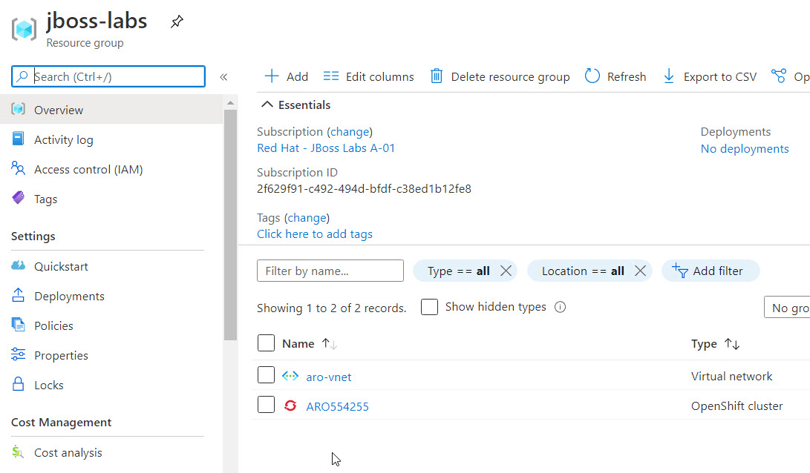
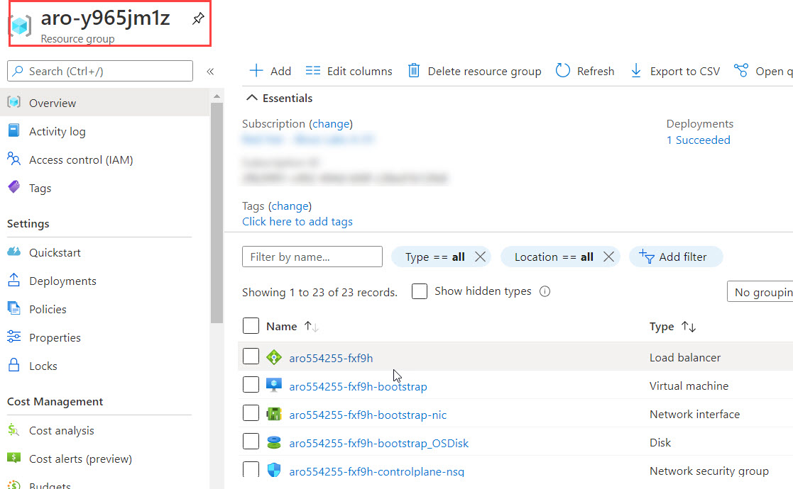
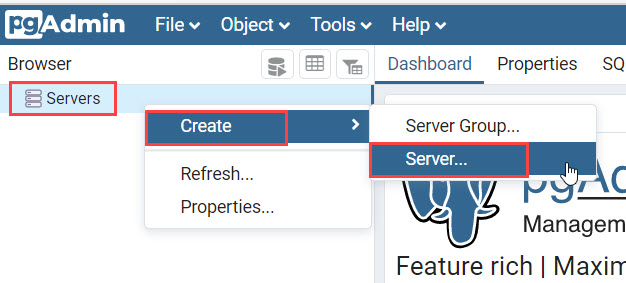
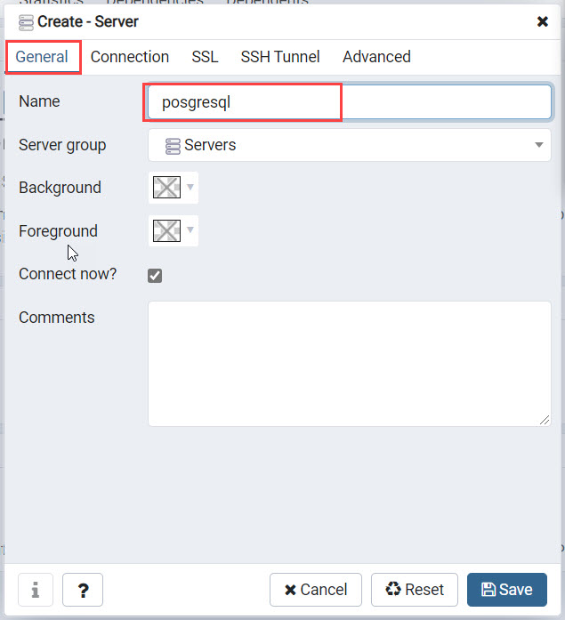
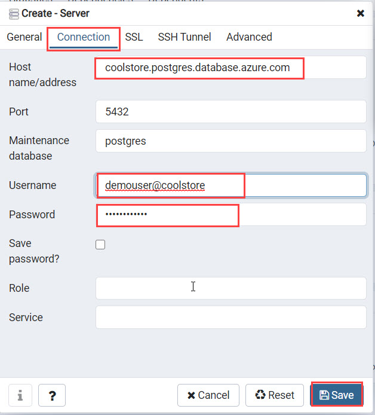
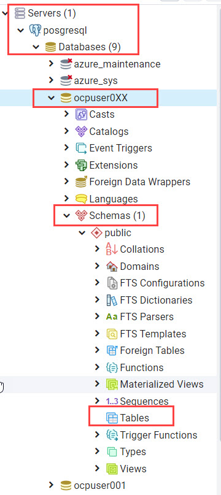

# Getting Started
## Validate your Azure Environment

Azure Red Hat OpenShift provides a flexible, self-service deployment of fully managed OpenShift clusters. Maintain regulatory compliance and focus on your application development, while your master, infrastructure and application nodes are patched, updated and monitored by both Microsoft and Red Hat. Choose your own registry, networking, storage or CI/CD solutions.
We are using a pre-created Azure Red Hat OpenShift cluster in this lab.

### Login to Azure

Navigate to https://portal.azure.com. Login using the Azure Username and Password provided in the lab enviornment details page. Select `Resource groups` to see all the Resource groups in the subscription

Open `Jboss-labs` resource group to see the pre-created OpenShift Cluster. You can see a Virtual Network and an Openshift cluster in this Resource group.  

<kbd></kbd>

Azure RedHat OpenShift has a couple of other related resources deployed in resourse. To see all the related resources open resource group with prefix `aro` (aro-XXXXXX)
You can explore through all the resources available here. You can also see the Master and Worker nodes created.

<kbd></kbd>

We are also using an Azure PostgreSQL Database in this lab. Please open `PostgreSQL` resources group to access the PostgreSQL Database. 

Open the PostgreSQL Database to see the Host name/Server name.

<kbd></kbd>

Username and password of the Azure Postgre SQL Database are provided in the environment details page.

To access PostgreSQL database, you need to install `PGAdmin` in your local machine (https://www.pgadmin.org/download/). Open the `PGAdmin` app, it will get open up in the default browser of your system.

PGAdmin may ask to set a master password while opening for the first time. Provide any password.

<kbd></kbd>

For connecting to our Azure PostgreSQL Database, Right Click on `Server`, select `Create` and then select `Server`.

<kbd></kbd>

In the new window that appear, provide a name for the connection. 

<kbd></kbd>

Then Select Connection tab and provide HostName , Username and Password.All these values will be available in the environment details page.

<kbd></kbd>

Once you successfully connected to the database, Expand `Databases` to see the database already created for you. The database name will be same as that of you OpenShift Username (for example : OCPUSER0XX). Now expand your database, Schemas and Tables. There won't be any tables availabe yet. We will create tables in Second and Third Exercise.

<kbd></kbd>

## Getting Started with OpenShift

In this lab you will also get familiar with the OpenShift CLI and OpenShift Web Console and get ready for the Application Modernization labs.

For completing the following labs, you can either use your own workstation or as an
alternative, CodeReady Workspaces web IDE. The advantage of your own workstation is that you use the
environment that you are familiar with while the advantage of CodeReady Workspaces is that all
tools needed (Maven, Git, OpenShift CLI, etc ) are pre-installed in it (not on your workstation!) and all interactions
takes place within the browser which removes possible internet speed issues and version incompatibilities
on your workstation.

The choice is yours but whatever you pick, like most things in life, stick with it for all the labs. We
ourselves are in love with CodeReady Workspaces and highly recommend it.

## Login to OpenShift web console

OpenShift ships with a web-based console that will allow users to
perform various tasks via a browser.  To get a feel for how the web console
works, open your browser and go to the **OpenShift Web Console url** provided in the environment details page.

The first screen you will see is the authentication screen. Select **htpasswd** option and enter your **OpenShift Workspace username** and **password** to login to OpenShift console.
<kbd></kbd>
<kbd></kbd>
CodeReady Workspaces and your deployment environment, both, run on this OpenShift cluster.

## Setup Your Workspace on CodeReady Workspaces

Follow these instructions to setup the development environment on CodeReady Workspaces.

You might be familiar with the Eclipse IDE which is one of the most popular IDEs for Java and other
programming languages. [CodeReady Workspaces](https://developers.redhat.com/products/codeready-workspaces/overview) is the next-generation Eclipse IDE which is web-based
and gives you a full-featured IDE running in the cloud. You have an CodeReady Workspaces instance deployed on your OpenShift cluster
which you will use during these labs.

Go to the **CodeReady Workspaces url** in order to configure your development workspace

Log into CodeReady Workspaces with your user account (you can find the username and password in the environment details page).

Click on the workspace shown in the **Recent Workspaces** section.
It takes a little while for the workspace to be ready. When it's ready, you will see a fully functional
CodeReady Workspaces IDE running in your browser.

This would be the point at which you would import the project skeletons into your workspace. For this lab, the projects are already imported into your workspace and are visible in the project explorer

Codeready Workspaces is a full featured IDE and provides language specific capabilities for various project types. 

Note the **Terminal** option in Codeready Workspaces. CLick on terminal and select **Open Terminal in Specific container**. Then select the default container to open the terminal. 

<kbd></kbd>
<kbd></kbd>

For the rest of these labs, anytime you need to run a command in a terminal, you can use the Codeready Workspaces Terminal window.

<kbd></kbd>

## Explore OpenShift with OpenShift CLI

In order to login, we will use the `oc` command. We can get the login command from OpenShift Console.

Go to your OpenShift console and click on your username icon on the top right of the screen to open up the pop-down menu and then select **"Copy Login Command"**. 

<kbd></kbd>

Then, it will open a new browser tab with a Display Token button. You can click on this button to get the login command.

<kbd></kbd>

Copy the entire login command, including your login token, to your clipboard.

<kbd></kbd>

Then, go to the CodeReady Workspaces Terminal window and paste the login command you copied in the previous step, and press **enter**

Congratulations, you are now authenticated to the OpenShift server.

Now you are ready to get started with the labs!
